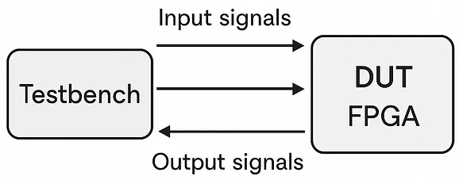
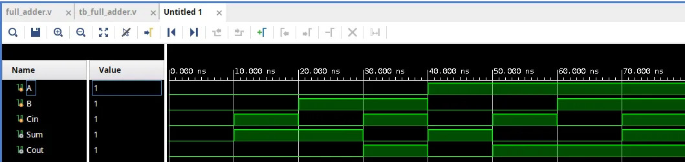

# 🧪 Verilog Testbench Essentials
### Creating and Simulating Testbenches in Verilog


---

## 📖 Overview

Creating testbenches in Verilog is an essential practice to verify the functionality of your modules and ensure your design behaves as expected.

A testbench is a special Verilog module used only for simulation. It instantiates the Device Under Test (DUT), applies input stimuli, and monitors the outputs to validate functionality.

Learning Objectives:

- Understand the structure of a Verilog testbench
- Instantiate and connect a DUT
- Generate input stimuli using timing control
- Monitor outputs during simulation
- Run simulations with tools like Vivado, ModelSim, Xcelium, or Icarus Verilog

---

## 📂 Repository Structure

```text
Verilog_Testbench_Essentials/
│
├── assets/
│   ├── Simplified_Diagram.jpg
│   └── Vivado_Simulation.jpg
│
├── src/
│   └── full_adder.v
│
├── tb/
│   └── tb_full_adder.v
│
├── License
│
└── README.md
```

---

## 🧠 What Is a Testbench?

A testbench is:

- Not synthesized
- Used only for simulation
- Responsible for applying inputs
- Responsible for observing outputs

It acts as a controlled environment where your design can be tested before hardware implementation.

---

## 🔧 Basic Structure of a Verilog Testbench

A typical testbench includes:

- Signal declaration (reg and wire)
- DUT instantiation
- Stimulus generation
- Output monitoring
- Timing control using ```#delay```

---

## 🧮 Example: Full Adder Testbench

**Full Adder Module** (```src/full_adder.v```)

```verilog
module full_adder (
    input A,
    input B,
    input Cin,
    output Sum,
    output Cout
);

    assign {Cout, Sum} = A + B + Cin;

endmodule
```

**Full Adder Testbench** (```tb/tb_full_adder.v```)

```verilog
module tb_full_adder;

    reg A, B, Cin;
    wire Sum, Cout;

    // DUT Instantiation
    full_adder uut (
        .A(A),
        .B(B),
        .Cin(Cin),
        .Sum(Sum),
        .Cout(Cout)
    );

    // Stimulus block
    initial begin
        A = 0; B = 0; Cin = 0;

        #10 A = 0; B = 0; Cin = 1;
        #10 A = 0; B = 1; Cin = 0;
        #10 A = 0; B = 1; Cin = 1;
        #10 A = 1; B = 0; Cin = 0;
        #10 A = 1; B = 0; Cin = 1;
        #10 A = 1; B = 1; Cin = 0;
        #10 A = 1; B = 1; Cin = 1;
        #10;

        $finish;
    end

    // Monitor block
    initial begin
        $monitor("A=%b, B=%b, Cin=%b -> Sum=%b, Cout=%b",
                  A, B, Cin, Sum, Cout);
    end

endmodule
```

---

## 🖼️ Simplified Testbench Diagram

<p align="center">
  
</p>

Figure 1: Testbench structure showing stimulus → DUT → monitored outputs.

---

## 🔍 Testbench Components Explained

### Signal Declaration

Inputs of the DUT are declared as ```reg``` (driven procedurally).

Outputs are declared as ```wire```.

```verilog
reg A, B, Cin;
wire Sum, Cout;
```

### DUT Instantiation

The DUT (Device Under Test) is instantiated and connected to the testbench signals. The instance is named ```uut``` (Unit Under Test), which is a common naming convention also adopted by tools such as Vivado.

```verilog
full_adder uut (
    .A(A),
    .B(B),
    .Cin(Cin),
    .Sum(Sum),
    .Cout(Cout)
);
```

### Stimulus Generator

The ```initial``` block applies different input combinations using ```#delay``` for timing control.

```verilog
#10 A = 1; B = 1; Cin = 0;
```

Each ```#10``` represents a 10-time-unit simulation delay.

### Output Monitoring

The ```$monitor``` system task prints values whenever they change.

```verilog
$monitor("A=%b, B=%b, Cin=%b -> Sum=%b, Cout=%b",
          A, B, Cin, Sum, Cout);
```

This creates a live log of simulation behavior.

---

## ▶️ Running the Simulation

With the testbench ready, you can use simulation tools such as **ModelSim**, **Xcelium**, **Vivado Simulator**, or **Icarus Verilog** (for example, using it together with VS Code).

Compile and run the simulation to observe the outputs. The results should match the expected truth table of a full adder. Figure 2 shows the simulation waveform generated using Vivado.

<p align="center"> 
   
</p>

The waveform must match the truth table of a full adder.

**Full Adder Truth Table**

| A | B | Cin | Sum | Cout |
|---|---|-----|-----|------|
| 0 | 0 |  0  |  0  |  0   |
| 0 | 0 |  1  |  1  |  0   |
| 0 | 1 |  0  |  1  |  0   |
| 0 | 1 |  1  |  0  |  1   |
| 1 | 0 |  0  |  1  |  0   |
| 1 | 0 |  1  |  0  |  1   |
| 1 | 1 |  0  |  0  |  1   |
| 1 | 1 |  1  |  1  |  1   |

---

## 🚀 Improving the Testbench

Here are some ways to enhance your testbench:

- **Automatic verification:** Use assertions to compare DUT outputs with expected values.
- **Randomized testing:** Apply ```$random``` stimuli using $random to check for unexpected behavior.
- **Edge case testing:** Specifically test boundary values and transitions for robustness.

---

## 🎯 Why Testbenches Matter

- Prevent hardware debugging headaches
- Validate logic before synthesis
- Reduce FPGA iteration time
- Improve design reliability

Simulation-first design is a professional industry practice.

---

## 📜 License

This project is open-source and available under the MIT License.

---

## 👨‍💻 Author

Developed as a learning-focused digital design project to demonstrate structured testbench development in Verilog.
